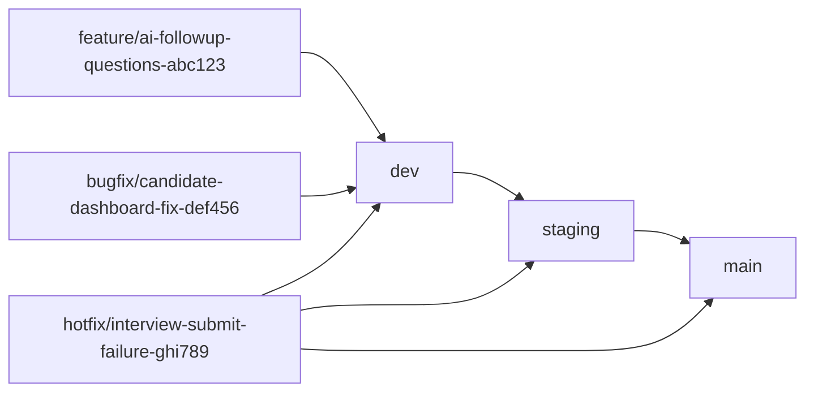

# Git Branching Strategy

## Core Branches

No direct push to any of it

### `dev`

- Active development branch
- Default branch for new work
- Used for local + early testing

### `staging`

- Cloud-based testing environment
- Used for team-wide QA, demo, and acceptance testing
- Mirrors production as closely as possible

### `main`

- Always production-ready
- Auto-deployed to production
- Protected branch (PRs only)

---

## Working Branches

Use this naming pattern for all branches:  
`[feature|bugfix|hotfix]` + short name + `-` clickup task id (Examples below)

---

### `feature/*`

- New features
- Branch off from: `dev`
- Merge back into: `dev`

**Examples**

```
feature/ai-followup-questions-abc123
```

### `bugfix/*`

- Bugs found in dev or staging
- Branch off from: `dev`
- Merge back into: `dev`

**Examples**

```
bugfix/candidate-dashboard-responsiveness-fix-def456

```

---

## Emergency Fixes

### `hotfix/*`

- Production-breaking issues
- Branch off from: `main`
- Merge into: `main`, `staging`, and `dev`

**Examples**

```
hotfix/interview-broken-flow-fix-ghi789

```

---

## Promotion Flow

```
feature / bugfix         hotfix
↓                          ↓
dev  ← ← ← ← ← ← ← ← ← ← ← ↓
↓                          ↓
staging  ← ← ← ← ← ← ← ← ← ↓
↓                          ↓
main ← ← ← ← ← ← ← ← ← ← ← ↓

```

---

## Daily Workflow

1. Create branch from `dev`
2. Ship small commits
3. Open PR -> quick review
4. Merge into `dev`
5. Promote `dev` → `staging` for team testing
6. Promote `staging` → `main` for production

---

## Rules (Keep It Simple)

- One feature or fix per branch
- No long-lived branches
- Delete branch after merge
- Prefer squash merges
- CI must pass before promotion

---

## Mermaid Diagram


